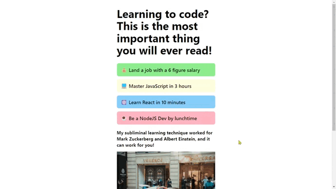

# Annoying Cookie Consent



## *Screenshot* :camera:


## *I learnt...* :nerd_face:

✅ setTimeout
```js
setTimeout(function() {
  //  CODE
}, 3000)
```

✅ element.style
```js
modal.style.display = "block"
```

✅ forms

✅ formData & .get()
```js
const formData = new FormData(consentForm)
const fullName = formData.get("fullName")
```

✅ event.preventDefault()
```js
consentForm.addEventListener("submit", function(e) {
  e.preventDefault()
})
```

✅ CSS: row-reverse
```css
.btn-wrap-reverse {
  flex-direction: row-reverse;
}
```

✅ toggling classes
```js
declineBtn.addEventListener("mouseenter", function() {
  btnWrap.classList.toggle("btn-wrap-reverse")
})
```

✅ 'disabled' attribute
```js
closebtn.disabled = false
```

## *Link* :link:

[Scrimba Projects](https://github.com/mendezpvi/fcp-scrimba)

## *Author* :beginner:

✨ Frontend Mentor - [mendezpvi](https://www.frontendmentor.io/profile/mendezpvi/)